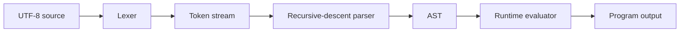

# Interpreter architecture

Latgalīte is implemented as a tree-walk interpreter in C++20.

## Source files

| File | Responsibility |
| --- | --- |
| `token.h` | Token kinds and token source locations |
| `lexer.h`, `lexer.cpp` | Source scanning, keywords, literals, and comments |
| `interpreter.h`, `interpreter.cpp` | AST definitions, parser, environments, functions, built-ins, and evaluation |
| `main.cpp` | Command-line file/stdin handling and error reporting |
| `CMakeLists.txt` | C++20 build configuration |

## Lexer

`Lexer` walks the source as bytes and produces `Token` objects containing a type,
text, line, and column. UTF-8 identifier bytes are accepted without performing
Unicode normalization or code-point decoding. Whitespace and comments are
discarded.

Keywords are stored in `Lexer::keywords_`. Adding a reserved word requires a
token kind in `token.h` and an entry in this map.

## Parser

The parser is a recursive-descent parser located in `interpreter.cpp`. It builds
small internal expression and statement trees. Expression parsing is split into
one method per precedence level, from logical `vai` down to primary expressions.

Syntax errors throw `std::runtime_error` with the current token's location. The
interpreter currently stops at the first error instead of attempting recovery.

## Runtime values

The internal `Value` variant can hold:

- `double` numbers;
- `std::string` text;
- `bool` values;
- shared pointers to arrays of `Value` objects.

Shared array pointers implement reference semantics and allow nested,
heterogeneous data structures.

## Environments and functions

An `Environment` maps names to typed variables and optionally points to a parent
environment. Lookup walks this parent chain. Blocks create child environments,
so local declarations disappear after the block while assignments can reach
outer variables.

User functions store typed parameters, their parsed body, and the environment in
which they were declared. A private return signal unwinds evaluation when an
`Atgriezt` statement executes.

## Evaluation

The runtime evaluates AST nodes directly. Logical `un` and `vai` are handled
before general binary evaluation to preserve short-circuit behavior. Assignments
resolve either a named variable or a nested indexed array target.

Built-ins are dispatched by function name in `Runtime::evaluateCall`. Language
statements such as `Izvadīt`, `Ja`, and `Kamēr` have dedicated AST statement
kinds instead.

## Extending the language

The usual steps for adding syntax are:

1. Add a token kind to `token.h` when new punctuation or a reserved word is
   required.
2. Teach `lexer.cpp` to produce it.
3. Add the corresponding parser rule or AST kind in `interpreter.cpp`.
4. Implement its runtime semantics.
5. Add a `.lat` example and document the behavior and error cases.

For a normal function-like operation, only a new branch in
`Runtime::evaluateCall` may be necessary. Keep built-in argument validation close
to its implementation and report failures through `runtimeError` so diagnostics
retain source locations.

## Current implementation boundaries

- Strings and text indexing are byte-oriented rather than Unicode-aware.
- Strings do not implement escape sequences.
- There is no module system, file I/O, exception handling, or concurrency.
- Parsing and execution stop at the first reported error.
- The evaluator prioritizes clarity over optimization; computation-heavy nested
  interpreters can be slow.
